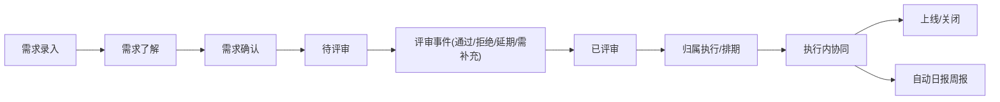

# 开发项目管理平台（Project Management Platform）README

## 1. 文档目标
本 README 用于把你提供的《项目开发管理平台_开发计划书_V1.1_需求池状态机方案A》落地为可执行的产品与技术方案，覆盖：

- 功能规划与合理性分析
- 页面与交互设计
- UI 规范与布局原则
- 技术栈与架构设计
- 数据库与接口设计
- 计划、验收标准、风险控制
- 需要你拍板的关键决策项

## 2. 对现有计划书的合理性分析

### 2.1 总体结论
你现有方案方向正确、主干完整，可直接作为 V1 研发基线，尤其在以下方面有明显优势：

- 主流程闭环完整：需求池 -> 评审 -> 立项/排期 -> 执行 -> 汇报
- 差异化明确：原子化权限 + 团队甘特 + 自动日报周报
- 状态机方案A成熟：把“需求了解/需求确认”和“评审事件”解耦，减少评审返工

### 2.2 已有方案的强项
- 需求池字段定义较完整，具备后续结构化分析基础
- 执行与日常执行双轨并行，符合真实团队工作形态
- 可配置意识较强（字段字典、流程模板、报表模板）
- 风险点预判清晰（权限复杂度、数据质量、日报质量）

### 2.3 当前缺口（本 README 已补齐）
- 缺少完整信息架构（页面树、路由、入口、页面关系）
- 缺少页面级交互细节（按钮条件、弹窗流程、错误反馈）
- 缺少 UI 视觉规范（颜色、字体、间距、组件状态）
- 缺少技术架构与工程规范（前后端选型、模块边界、目录规范）
- 缺少数据库实体与索引方案（表结构、约束、审计、扩展）
- 缺少接口契约规范（错误码、幂等、权限校验、分页）

### 2.4 术语统一
- 术语统一：本文中的“任务”仅作为历史叫法，研发与实现统一使用“执行（Execution）”。
- 数据模型统一：根执行与子执行均属于 execution 实体，不再建设独立 task 实体。

## 3. 产品定位、范围与边界

### 3.1 产品定位
面向研发团队内部的项目开发管理平台，对标 Teambition/Jira 的核心能力，重点强化：

- 精细化权限与审计
- 团队维度排期可视化
- 基于行为数据的自动汇报

### 3.2 首期范围（V1）

| 模块 | 目标 | 优先级 |
| --- | --- | --- |
| 登录与组织 | 用户登录、组织成员、角色权限 | P0 |
| 工作台 | 我的执行、今日到期、阻塞聚合、快捷入口 | P0 |
| 需求池 | 录入、检索、状态机、评审记录、批量生成执行 | P0 |
| 项目管理 | 项目列表、项目数据总览、项目状态维护 | P0 |
| 执行管理 | 独立执行菜单、执行列表筛选、执行内协同 | P0 |
| 缺陷管理 | Bug 挂靠项目/执行、批量编辑、草稿统一提交、自动通知 | P0 |
| 日常执行 | 一行快速创建、默认归类、时间排序、汇报纳入 | P0 |
| 甘特排期 | 执行甘特、团队甘特、冲突提示 | P0 |
| 日报周报 | 自动抽取、一键生成、编辑导出 | P0 |
| 系统设置 | 字典、状态流模板、权限策略模板 | P0 |
| 报表统计 | 管理员视角的计划/实际/工作内容统计 | P0 |

### 3.3 首期明确不做
- 即时通讯替代（仅做通知对接）
- 复杂计费/结算
- 移动端完整实现（可做移动浏览适配）
- 高级资源优化算法（首期只做冲突检测与提示）

## 4. 用户角色与权限模型

### 4.1 标准角色
- 超级管理员：系统级配置、组织与策略托管
- 组织管理员：组织成员、角色模板、全局可见项目
- 项目管理员：项目配置、成员管理、排期管理
- 需求负责人：需求录入、推进、评审发起
- 执行成员（研发/测试/设计）：执行推进、评论、更新状态
- 只读访客：查看与导出（受限）

### 4.2 授权模型（RBAC + ABAC）
- RBAC：角色模板赋予默认资源动作
- ABAC：按部门、项目、参与关系、字段、数据状态做条件控制
- 权限表达式：`resource + action + scope + condition`

示例：
- `execution.edit.scope=self_or_assignee`
- `gantt.edit.scope=project_only && role in [project_admin]`
- `requirement.export.scope=org && sensitivity!=secret`

### 4.3 原子化权限清单（示例）

| 页面 | 控件/字段 | 权限点 |
| --- | --- | --- |
| 需求详情 | `发起评审`按钮 | `requirement.review.create` |
| 需求详情 | `优先级`字段编辑 | `requirement.field.priority.edit` |
| 执行详情 | `删除执行`按钮 | `execution.delete` |
| 甘特页 | `拖拽排期` | `schedule.edit` |
| 报表页 | `导出`按钮 | `report.export` |

## 5. 信息架构与页面设计

### 5.1 全局布局（PC）
- 顶部栏：组织切换、全局搜索、通知、个人菜单
- 左侧导航：工作台、需求池、项目、执行、缺陷、日常执行、甘特、报表、设置
- 主内容区：列表/看板/详情双栏可切换结构
- 右侧抽屉：详情快览、日志、评论、附件

布局规则：
- 默认 1440 栅格设计，12 栅格布局
- 主内容最小宽度 1200
- 所有列表支持固定表头、列配置、保存视图

### 5.2 页面树（V1）

```text
/login
/workspace
/requirements
/requirements/:id
/projects
/executions
/executions/:executionId
/executions/:executionId/board
/executions/:executionId/list
/executions/:executionId/gantt
/bugs
/bugs/:bugId
/daily
/gantt/team
/reports/daily
/reports/weekly
/settings/org
/settings/members
/settings/roles
/settings/policies
/settings/dictionaries
/settings/workflows
```

### 5.3 关键页面交互（核心）

#### 5.3.1 工作台 `/workspace`
- 模块：
  - 我负责执行（按截止时间）
  - 我参与执行（按最近更新）
  - 阻塞执行（高亮）
  - 今日到期/逾期
  - 快捷创建（日常执行/需求/执行）
- 交互：
  - 输入框回车直接创建日常执行
  - 卡片点击右侧抽屉打开详情，不离开页面
  - 支持“生成今日日报”快捷按钮

#### 5.3.2 需求池 `/requirements`
- 视图：默认表格视图（首选），可扩展看板视图
- 表格关键列（仅展示重要字段）：需求ID、需求标题、状态、优先级、负责人、期望上线时间、更新时间、关联执行数
- 关键操作：
  - 批量选择 -> `生成执行`
  - 不勾选需求 -> 直接新建项目/执行
  - 保存筛选视图（例如“P0待评审”）
- 交互约束：
  - 点击表格行打开需求详情弹窗（不离开当前筛选上下文）
  - 弹窗展示完整字段、评审记录、关联执行、操作日志
  - 发起评审前触发“成熟度检查”
  - 批量操作弹窗显示影响条数与回滚提示

#### 5.3.3 需求详情 `/requirements/:id`
- 顶部：状态机轨迹 + 当前状态 + 负责人 + 优先级
- 中部：需求描述、附件、关联执行
- 右侧：评审记录（Review Records）时间线
- 按钮显示策略（按状态）：
  - 草稿/了解：`进入确认`、`补充信息`
  - 确认：`发起评审`（缺项阻断或警告）
  - 待评审：`评审通过/拒绝/延期/需补充`
  - 已评审：`归属执行/排期`、`生成执行`

#### 5.3.4 项目菜单 `/projects`
- 项目菜单保持安静管理视角，仅提供列表与状态总览
- 展示形式：表格
- 列表关键列：项目ID、项目名称、项目代号、负责人、状态、关联需求数、关联执行数、风险数、更新时间
- 支持按负责人/状态/关键字筛选，支持导出
- 点击项目可查看关联需求与关联执行
- 关联需求/关联执行支持点击后直接跳转到对应详情页

#### 5.3.5 执行菜单 `/executions`（独立入口）
- 执行菜单用于集中管理“正在进行的开发执行”，体验对标禅道“执行”列表
- 展示形式：表格
- 顶部状态标签：全部、未完成、未开始、进行中、已挂起、已关闭
- 列表字段：ID、执行名称、所属项目、执行状态、执行负责人、计划开始、计划完成、实际完成、计划进度、实际进度、预计、消耗、剩余
- 默认排序：进行中优先 + 计划完成时间升序
- 支持“仅看我负责”“仅看逾期”“仅看有风险”快捷筛选
- 点击执行名称进入执行详情页

#### 5.3.6 执行内协同
- 执行详情默认仍为表格形态（树形表格）
- 最左列为“执行名称”，支持展开/收起层级
- 在节点行点击 `+` 可在当前节点下新建子执行并设置属性
- 根节点执行与子执行都支持字段编辑（状态、负责人、排期、优先级、依赖、备注）
- 计划开始/结束时间由子执行自动汇总：
  子执行填写计划开始/结束后，父执行自动取最早计划开始和最晚计划结束；若父执行仍有上级，则继续向上递归写入。
- 实际开始/完成时间自动汇总：
  父执行实际开始取子执行最早实际开始；当全部子执行完成后，父执行实际完成取最晚实际完成时间。
- 进度双指标并行展示：
  叶子执行维护实际进度；父执行默认按子执行预计工时加权汇总实际进度，若未配置预计工时则按子执行平均值计算。
- 计划进度默认按当前日期在计划开始/计划结束区间内的时间比例自动计算。
- 提前完成处理：
  叶子执行若早于计划结束完成，必须保留真实实际完成时间；在计划周期尚未结束时，实际进度可为 `100%`，计划进度仍按计划周期计算，用于直观看出提前/滞后偏差。
- 跨天执行支持工时填报：
  点击工时/耗时字段弹出工作日志窗口，按天填写工作内容与耗时。
- 每日工作日志进入日报采集：
  对跨天执行，当日填写的工作内容与耗时会在自动日报中体现，避免跨天执行日报无进度。
- 支持评论与@提醒、操作日志、附件
- 根节点执行与子执行均纳入自动日报采集范围（满足采集时间窗即进入统计）

#### 5.3.7 日常执行 `/daily`
- 一行输入创建，回车提交
- 快捷日期：今天/明天/本周五
- 默认排序：最近更新时间倒序
- 筛选：全部、今天、本周、逾期、已完成
- 支持“本条不纳入汇报”开关

#### 5.3.8 甘特 `/gantt/team` 与 `/executions/:executionId/gantt`
- 团队甘特：按成员行展示执行条
- 执行甘特：按执行层级展示依赖与关键节点
- 交互：
  - 新增模式切换：`总览模式` 与 `详情模式`
  - 总览模式仅展示整个执行的浅色时间条，点击后浮窗展示计划进度、实际进度、计划开始/结束、实际完成时间
  - 详情模式在执行条下展开全部子执行，点击子执行同样展示计划进度、实际进度、计划时间与实际完成时间
  - 悬停显示执行摘要、依赖、风险
  - 冲突执行红色边框 + 顶部冲突汇总栏
  - 首期以表单修改排期为主，拖拽改期可配置开关

#### 5.3.9 缺陷管理 `/bugs`
- 缺陷管理为独立模块，支持统一管理 Bug
- 缺陷可挂靠到项目或执行：
  挂靠项目表示日常发现的 Bug；
  挂靠执行表示开发/测试环节发现的 Bug。
- 支持批量新增、批量编辑、多条草稿统一提交
- 提交后自动通知对应负责人
- 缺陷关键字段：标题、严重级别、优先级、状态、挂靠类型、挂靠对象、负责人、提出人、复现步骤、期望结果、实际结果

#### 5.3.10 报告 `/reports/daily` `/reports/weekly`
- 一键生成草稿 -> 编辑 -> 复制/导出
- 报告结构固定：完成、进行中、阻塞风险、后续计划
- 可按组织/项目/个人维度切换
- 管理员统计视角独立展示：
  执行计划时间、实际时间、参与开发人员的实际工作内容（子执行名称 + 每日日志内容）
- 管理员支持下钻查看：
  成员 -> 日期 -> 子执行 -> 当日日志内容，用于核对实际投入与日报归纳结果

## 6. 核心流程与状态机

### 6.1 主流程



### 6.2 需求状态机（方案A）
- `Draft` -> `Understanding` -> `Confirmed` -> `ToReview` -> `Reviewed` -> `Scheduled` -> `InDevelopment` -> `Released` -> `Closed`
- 允许从 `Reviewed` 基于重大变更再次触发评审事件，不覆盖历史记录

### 6.3 评审机制（事件，不是状态）
Review Record 必含：
- 评审发起人、时间、参与人
- 结论：通过/拒绝/延期/需补充
- 决策：优先级、是否立项、归属项目与执行
- 备注：争议点、决策依据、后续行动项

### 6.4 执行状态机（建议）
- 待开始 -> 进行中 -> 阻塞 -> 待验收 -> 已完成 -> 已关闭
- 回退规则：
  - 阻塞解除可回到进行中
  - 验收未通过回到进行中
  - 已关闭仅项目管理员可 reopen

### 6.5 日常执行状态机
- 未开始 -> 进行中 -> 完成 / 搁置
- 完成可撤销（记录操作日志）

## 7. 数据库设计（MySQL）

### 7.1 数据库配置（按你的规范）
- 主机：`localhost`
- 端口：`3306`
- 用户：`root`
- 密码：`Wangjun@123`
- 建议库名：`project_mgmt_dev`（生产：`project_mgmt_prod`）

### 7.2 核心表（V1）

| 表名 | 用途 | 关键字段 | 关键索引 |
| --- | --- | --- | --- |
| `users` | 用户 | name, email, status | email(unique), status |
| `org_members` | 组织成员 | user_id, dept_id, role_ids | user_id, dept_id |
| `roles` | 角色模板 | code, name | code(unique) |
| `policies` | 权限策略 | resource, action, scope, condition | resource+action |
| `requirements` | 需求池 | title, status, owner_id, priority, due_date | status+priority, owner_id, created_at |
| `requirement_reviews` | 评审记录 | requirement_id, result, reviewer_id, decision_json | requirement_id, review_time |
| `projects` | 项目 | name, code, owner_id, status | code(unique), owner_id |
| `executions` | 研发执行（树形） | project_id, parent_execution_id, execution_name, status, owner_id, plan_start/end, actual_start/end, planned_progress, actual_progress | project_id+status, owner_id+status, parent_execution_id |
| `execution_dependencies` | 执行依赖关系 | predecessor_execution_id, successor_execution_id, type | predecessor_execution_id, successor_execution_id |
| `daily_executions` | 日常执行 | owner_id, status, due_at, exclude_from_report | owner_id+status, due_at |
| `execution_worklogs` | 执行工时日志 | execution_id, work_date, work_content, hours_spent, creator_id | execution_id+work_date, creator_id |
| `bugs` | 缺陷 | title, severity, priority, status, link_type, link_id, owner_id | link_type+link_id, owner_id+status, created_at |
| `comments` | 评论 | target_type, target_id, content | target_type+target_id, creator_id |
| `attachments` | 附件 | target_type, target_id, file_url | target_type+target_id |
| `activity_logs` | 审计日志 | operator_id, target_type/id, action, diff_json | target_type+target_id, created_at |
| `report_snapshots` | 日报周报快照 | report_type, owner_id, content_md, generated_at | owner_id+report_type+generated_at |

### 7.3 数据库规范
- 表名/字段名全小写，下划线分隔
- 所有业务表统一 `id(bigint)` 主键，`created_at/updated_at/deleted_at`
- 删除默认软删，配合回收站
- 长文本使用 `text`，复杂结构用 `json`

### 7.4 性能与可维护性
- 列表查询统一分页，限制单页最大条数
- 高频筛选字段建复合索引（`status + owner_id + priority`）
- 大表按时间或组织分区（V2）
- 定期执行 `analyze table` 与慢查询巡检

## 8. 接口设计规范（API）

### 8.1 API 风格
- 协议：HTTPS + JSON
- 风格：RESTful，必要时补充 `/actions/*` 语义接口
- 版本：`/api/v1`

### 8.2 响应结构
```json
{
  "code": 0,
  "message": "ok",
  "data": {},
  "request_id": "trace-id"
}
```

错误码约定：
- `0` 成功
- `400xx` 参数错误
- `401xx` 未认证
- `403xx` 无权限
- `404xx` 资源不存在
- `409xx` 状态冲突/幂等冲突
- `500xx` 系统错误

### 8.3 核心接口分组
- 认证：`/auth/login` `/auth/logout` `/auth/refresh`
- 需求：`/requirements` `/requirements/{id}` `/requirements/{id}/reviews` `/requirements/batch-generate-executions`
- 项目：`/projects` `/projects/{id}`
- 执行：`/executions` `/executions/{id}` `/executions/{id}/children` `/executions/{id}/dependencies`
- 执行工时：`/executions/{id}/worklogs`
- 缺陷：`/bugs` `/bugs/{id}` `/bugs/batch-submit`
- 日常：`/daily-executions`
- 甘特：`/schedules/team-gantt` `/schedules/execution-gantt`
- 报告：`/reports/daily/generate` `/reports/weekly/generate`
- 权限：`/roles` `/policies` `/permission/check`

### 8.4 关键工程约束
- 所有写接口必须做后端权限强校验
- 批量写操作要求幂等键 `Idempotency-Key`
- 关键操作写 `activity_logs`
- 导出接口默认异步作业，防止阻塞

## 9. 技术栈与架构建议（已按决策收敛）

### 9.1 最终技术栈（已确认）
- 前端：`React 18 + TypeScript + Vite + Ant Design 5 + TanStack Query + Zustand + React Router`
- 后端：`PHP 8.3 + ThinkPHP 8 + ThinkORM`
- 数据库：`MySQL 8.0`
- 缓存队列：`Redis`
- 文件存储：`MinIO`（本地）/ `OSS`（生产）
- 搜索（可选）：`OpenSearch`（V2）
- 定时调度：`Redis 队列 + Cron/命令调度`（日报周报定时）
- 鉴权：`JWT + RBAC/ABAC 策略引擎`
- 通知：`站内通知 + 钉钉机器人/Webhook`

### 9.2 架构分层
- 表现层：Web 前端、管理后台
- 应用层：需求域、项目域、执行域、排期域、报表域、权限域
- 基础设施层：MySQL、Redis、对象存储、消息队列、日志系统

### 9.3 工程目录建议

```text
project-management-platform/
  README.md
  docs/
    product/
    api/
    technical/
    decisions/
  frontend/
    .env.example
    src/
      components/
      constants/
      layouts/
      pages/
      router/
      services/
      store/
      utils/
      images/
        icons/
        illustrations/
  backend/
    .env
    .example.env
    app/
      controller/
      service/
      model/
      validate/
      support/
      utils/
      job/
      command/
    config/
    route/
```

说明：
- 前后端均提供 `utils`，避免重复造轮子
- 网络请求统一封装为 Promise 风格
- API/技术文档统一存放在 `docs/`

## 10. UI 设计规范（V1）

### 10.1 视觉风格
- 风格：专业管理台、信息密度高、强调状态与风险
- 主色：`#1677FF`
- 成功：`#52C41A`
- 警告：`#FAAD14`
- 危险：`#F5222D`
- 中性色：`#1F1F1F`、`#595959`、`#BFBFBF`、`#F5F5F5`

### 10.2 字体与间距
- 字体：`PingFang SC`, `Microsoft YaHei`, sans-serif
- 基准字号：14px（表单/列表），关键数据 16-20px
- 行高：1.5
- 8px 间距体系：8/12/16/24/32

### 10.3 组件规范
- 按钮：主按钮用于关键动作，危险动作二次确认
- 表格：支持列冻结、列显示配置、批量选择
- 抽屉：用于详情快览，减少页面跳转
- 标签：状态色与优先级色全局统一

### 10.4 交互反馈
- 成功：轻提示 + 状态更新
- 失败：明确错误原因 + 修复建议
- 加载：骨架屏/局部 loading，不阻塞整页
- 空态：提供下一步操作入口

## 11. 自动日报/周报设计

### 11.1 抽取规则
- 日报统计时间窗：当天 00:00-23:59
- 周报统计时间窗：周一 00:00 到周日 23:59
- 数据源：
  - 执行状态变更（包含根节点执行与子执行）
  - 执行工时日志（工作内容 + 耗时）
  - 评论和关键日志
  - 日常执行新增/完成

### 11.2 模板结构
- 已完成
- 进行中
- 阻塞与风险
- 下一步计划

### 11.3 质量控制
- 允许用户编辑草稿后发布
- 支持执行级排除汇报
- 支持组织级模板配置

### 11.4 管理员统计视图
- 管理员可查看执行计划开始/计划结束/实际完成时间
- 管理员可查看参与成员每日工作内容与耗时
- 统计明细按子执行名称和日报填报内容展示

## 12. 非功能要求

### 12.1 性能目标
- 常规列表接口 P95 < 300ms
- 复杂筛选接口 P95 < 800ms
- 甘特首屏渲染 < 2s（1000 条执行以内）

### 12.2 安全要求
- 全链路鉴权与权限校验
- 敏感导出控制（按角色和数据范围）
- 审计日志不可篡改（至少防应用层修改）
- 防注入、防越权、防CSRF/XSS

### 12.3 可靠性要求
- 关键写操作幂等
- 文件上传失败可重试
- 备份与恢复演练（每月）
- 删除进入回收站，支持恢复

## 13. 开发计划（建议排期）

| 阶段 | 周期 | 交付内容 |
| --- | --- | --- |
| 阶段0 需求冻结 | 第1周 | PRD/原型/数据模型/技术选型冻结 |
| 阶段1 基础框架 | 第2-3周 | 组织成员、权限骨架、项目/执行基础CRUD |
| 阶段2 需求池 | 第4-5周 | 状态机、评审事件、批量生成执行 |
| 阶段3 工作台+日常 | 第6周 | 工作台聚合、日常快速创建、汇报纳入 |
| 阶段4 甘特排期 | 第7-8周 | 执行甘特总览/详情、团队甘特、冲突检测 |
| 阶段5 执行工时与缺陷 | 第9周 | 工时日志、跨天工作内容、缺陷管理 |
| 阶段6 日报周报与管理统计 | 第10周 | 自动生成、模板编辑、管理员统计视图 |
| 阶段7 联调与验收 | 第11周 | 压测、安全检查、UAT验收 |
| 阶段8 灰度上线 | 第12周 | 生产部署、培训、运营观测 |

## 14. 验收标准（V1）
- 支持多选需求批量生成执行；支持无需求直接新建项目/执行
- 需求与执行保持双向关联；需求详情可查看执行进度汇总
- 需求池采用表格展示，点击行可弹出详情弹窗，且表格只展示关键字段
- 项目菜单采用表格展示，点击项目可查看并跳转关联需求与关联执行
- 执行详情为树形表格，最左列执行名称支持 `+` 新建子执行
- 子执行维护计划时间后，父执行与更高层父执行自动汇总计划开始/结束时间
- 子执行维护实际开始/实际完成后，父执行与更高层父执行自动汇总实际时间
- 跨天执行可按天填写工作内容与耗时，且日报自动体现
- 缺陷支持挂靠项目或执行，支持多条草稿统一提交并自动通知负责人
- 日常执行回车快速新增，自动归类并支持时间筛选
- 团队甘特按成员展示并识别执行重叠冲突
- 甘特支持总览模式与详情模式，点击条形可查看计划进度与实际进度
- 执行展示实际完成时间、计划进度与实际进度，提前完成时保留真实完成时间
- 自动日报采集覆盖根节点执行与子执行
- 日报周报可自动生成、编辑、导出
- 管理员报表可查看执行计划时间、实际时间及成员工作内容，并支持下钻到成员当日日志
- 无权限接口调用必须返回 `403xx`

## 15. 文档管理要求
- 根目录保留本 README（总览）
- 详细文档统一写入 `docs/`：
  - `docs/product/` 产品与交互文档
  - `docs/api/` API 文档
  - `docs/technical/` 技术方案
  - `docs/decisions/` 架构决策记录（ADR）

## 16. 本地开发快速开始

### 16.1 环境
- Node.js 20+
- PHP 8.3+
- Composer 2+
- MySQL 8.0+
- Redis 7+

### 16.2 MySQL 初始化
```sql
CREATE DATABASE IF NOT EXISTS project_mgmt_dev
  DEFAULT CHARACTER SET utf8mb4
  COLLATE utf8mb4_unicode_ci;
```

### 16.3 环境变量示例
```bash
DB_HOST=localhost
DB_PORT=3306
DB_USER=root
DB_PASS=Wangjun@123
DB_NAME=project_mgmt_dev
REDIS_URL=redis://127.0.0.1:6379
JWT_SECRET=replace_me
DINGTALK_APP_KEY=replace_me
DINGTALK_APP_SECRET=replace_me
DINGTALK_BIND_REDIRECT_URI=http://localhost:3000/auth/dingtalk/callback
VITE_API_BASE_URL=http://127.0.0.1:8000/api/v1
```

### 16.4 后端启动
```bash
cd backend
cp .example.env .env
php think run
```

默认健康检查接口：
```bash
curl http://127.0.0.1:8000/api/v1/health
```

默认开发账号：
```text
username: admin
password: Admin@123456
```

### 16.5 前端启动
```bash
cd frontend
cp .env.example .env
npm install
npm run dev
```

## 17. 已确认决策（2026-03-09）
1. 后端技术栈：`PHP`（本文档默认以 `ThinkPHP 8` 作为落地框架）
2. 前端基础框架：`React + Vite`
3. 权限粒度首期范围：`页面+按钮级`
4. 甘特拖拽改期：`不进入V1`
5. 工时管理：`纳入V1（轻量工时日志 + 每日工作内容，复杂核算不纳入）`
6. 通知渠道优先级：`站内通知 + 钉钉`
7. 账号体系：`账号密码 + 绑定钉钉`
8. 组织模型：`单组织单租户，仅内部团队使用`

## 18. 下一步交付文档
- `docs/product/PRD_v1.md`
- `docs/api/openapi_v1.yaml`
- `docs/technical/architecture_v1.md`
- `docs/decisions/ADR-0001-tech-stack.md`
